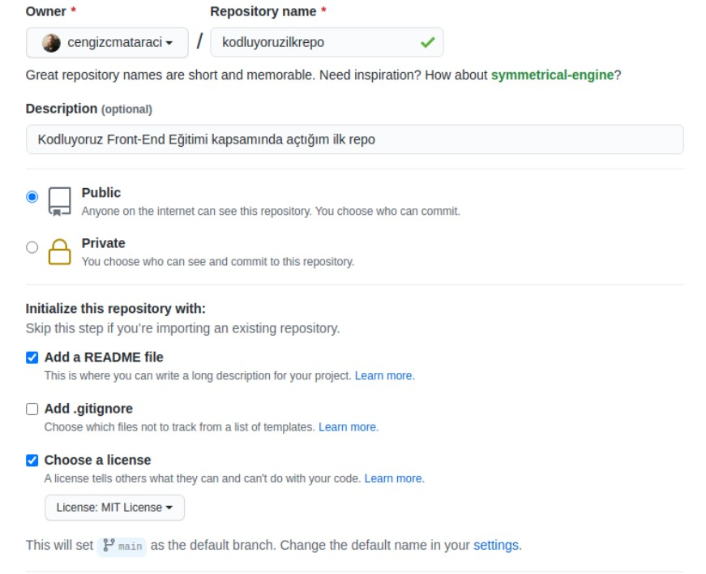

# kodluyoruzilkrepo

Bu repo [Kodluyoruz](https://www.kodluyoruz.org/)Front-End Eğitiminde Oluşturduğumuz ilk repo,içerisinde bir adet README dosyası,bir adet de index.html barındırıyor.
# Installation
Öncelikle projeyi clonelayın.(Buraya sizin reponuzdan aldığınız link gelecek)
'https://github.com/1tek1/kodluyoruzilkrepo.git'
# Usage
Projeyi cloneladıktan sonra Visual Studio Code programında açınız.

Linux için:
'''
cd kodluyoruzilkrepo
code.
'''
# Contributing
Pull requastler kabul edilir.Büyük değişiklikler için,lütfen önce meyi değiştirmek istediğinizi tartışmak için bir konu açınız.
# License
[MIT](https://github.com/1tek1/kodluyoruzilkrepo/blob/main/LICENSE)

